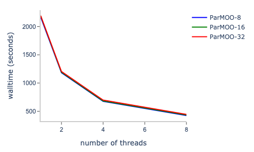
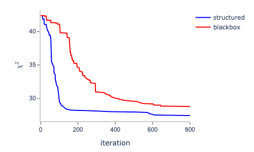
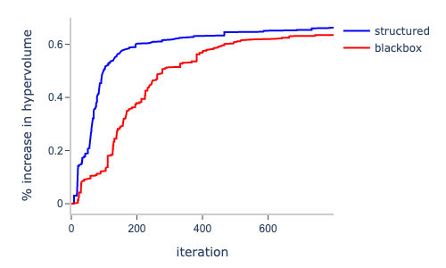
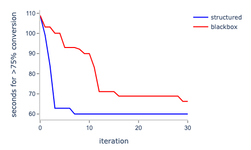
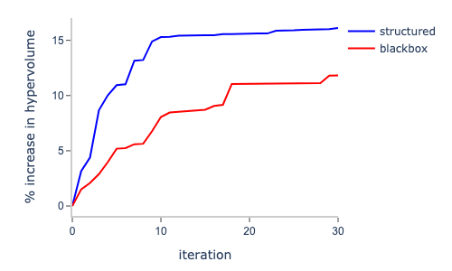

[](https://pubsonline.informs.org/journal/ijoc)

# ParMOO Solvers: Sample Simulation Optimization Problems and Solvers

This archive is distributed in association with the [INFORMS Journal on
Computing](https://pubsonline.informs.org/journal/ijoc) under the [BSD
3-Clause License](LICENSE).

This repository contains several multiobjective simulation optimization (MOSO)
problem definitions, scripts for solving those problems with an archived
version ([v0.2.2](https://github.com/parmoo/parmoo/releases/tag/v0.2.2)) of the ParMOO software, and an archived version of the ParMOO software.
The data collected in this repository were used in the research reported on in
the paper

[Designing a Framework for Solving Multiobjective Simulation Optimization
Problems](https://doi.org/10.1287/ijoc.2023.0250) by Tyler H. Chang and Stefan M. Wild.

**Important**:  Both ParMOO and the solver farm are under active development.
For information on how to obtain the latest version, see the instructions in
[Continued Development](https://github.com/INFORMSJoC/2023.0250?tab=readme-ov-file#continued-development)

## Cite

To cite the contents of this repository, one can cite both the paper and this
repo using their respective DOIs:

[The journal article](https://doi.org/10.1287/ijoc.2023.0250):

```
@article{chang2024,
  author =        {Chang, Tyler H. and Wild, Stefan M.},
  journal =       {INFORMS Journal on Computing},
  title =         {Designing a Framework for Solving Multiobjective Simulation Optimization Problems},
  year =          {2025},
  doi =           {10.1287/ijoc.2023.0250.cd},
  note =          {To Appear},
}
```

[This repository](https://doi.org/10.1287/ijoc.2023.0250.cd):

```
@misc{chang2024,
  author =        {Chang, Tyler H. and Wild, Stefan M.},
  publisher =     {INFORMS Journal on Computing},
  title =         {Repository for ``Designing a Framework for Solving Multiobjective Simulation Optimization Problems''},
  year =          {2024},
  doi =           {10.1287/ijoc.2023.0250.cd},
  note =          {Available for download at https://github.com/INFORMSJoC/2023.0250},
}
```

## Description

The goal of this repository is to:

 1) Provide access to the test problems used for benchmarking ParMOO in the
    paper;
 2) Provide samples scripts demonstrating how ParMOO can be used to build
    solvers for these problems; and
 3) Provide archives/references for the correct version of ParMOO and other
    dependencies for reproducing the reported results.

The `scripts` directory contains several subdirectories for reproducing the
experiments from Sections 4-6 of the paper.

The `results` directory contains the raw data collected for the results
reported in the paper.

The `src` directory contains an archive of ParMOO v0.2.2, which was the version
used to collect results in the corresponding journal article, although newer
versions are now available -- see
[Continued Development](https://github.com/INFORMSJoC/2023.0250?tab=readme-ov-file#continued-development).

## Setup and Installation

To use or compare against any of the sample problems, enter into the
appropriate `scripts` subdirectory (labeled for the corresponding sections in
the paper) and ``pip``-install the ``REQUIREMENTS``
file for that example.

```
cd scripts/section-x/
python3 -m pip install -r REQUIREMENTS.txt
```

Note that the above instructions will install a specific older release of
ParMOO (v0.2.2), as was used in the reported experiments.  However, newer
releases of ParMOO can be obtained by following the links in
[Continued Development](https://github.com/INFORMSJoC/2023.0250?tab=readme-ov-file#continued-development)

### Archival ParMOO Source (Not Recommended)

Alternatively, for INFORMS Journal of Computing archival purposes, a snapshot
of the ParMOO ``v0.2.2`` source code is made available in this repository via
the `src/parmoo_v022` subdirectory.  We used ``v0.2.2`` for the ``results`` and
``scripts`` in this repository.

Again, this snapshot source is included here solely for INFORMS Journal of
Computing archival purposes; we recommend that users reproduce the results
using the method above, and obtain the latest version by following the
instructions in
[Continued Development](https://github.com/INFORMSJoC/2023.0250?tab=readme-ov-file#continued-development)

## Replicating

To run the experiments, see further instructions in the `README.md` file within
each of the corresponding `scripts/section-x` subdirectories.  Each of these
subdirectories will reproduce the data files either in that same directory or
in a subdirectory thereof.

## Results

The raw performance data from our experiments are contained in the
`results/section-x` subdirectories.  This data is presented in Sections 4, 5,
and 6 of the
[corresponding journal article](https://doi.org/10.1287/ijoc.2023.0250).

Table 2 (from Section 4) of the paper shows the hypervolume indicator for pymoo
and various configurations of ParMOO when solving the DTLZ2 test problem from
the literature with batch sizes 8, 16, 32. Larger values are better.

|Method      | pymoo | ParMOO-8 | ParMOO-16 | ParMOO-32 |
|------------|-------|----------|-----------|-----------|
|Hypervolume | 0.28  | 0.33     | 0.33      | 0.37      |

Figure 4 (from Section 4) of the paper shows the walltimes when performing
1,000 1-3 second simulation evaluations in ParMOO (with batch sizes 8, 16, and
32) with increasing number of threads.



Figure 5 (from Section 5) of the paper shows the iteration vs. $\chi^2$ loss
when solving the Fayans EDF calibration with ParMOO, exploiting the
sum-of-squares structure (structured) and with a standard (black-box) approach.
The total simulations used by the end of iteration $k$ are calculated as
$2000 + 10k$.



Figure 6 (from Section 5) of the paper shows the iteration vs. percentage
hypervolume improvement when solving the Fayans EDF calibration with ParMOO,
exploiting the sum-of-squares structure (structured) and with a standard
(black-box) approach. The total simulations used by the end of iteration $k$
are calculated as $2000 + 10k$.



Figure 7 (from Section 6) of the paper shows the iteration vs. minimum reaction
time that achieves at least a 75% conversion rate when solving the CFR chemical
manufacturing problem with ParMOO, exploiting the heterogeneous structure
(structured) and with a standard (black-box) approach. The total simulations
used by the end of iteration $k$ are calculated as $50 + 3k$.



Figure 8 (from Section 6) of the paper shows the iteration vs. percentage
hypervolume improvement when solving the CFR chemical manufacturing problem
with ParMOO, exploiting the heterogeneous structure (structured) and with a
standard (black-box) approach. The total simulations used by the end of
iteration $k$ are calculated as $50 + 3k$.



## Continued Development

ParMOO is under continuous development.  For the latest version of the ParMOO
library

 * visit our [GitHub page](https://github.com/parmoo/parmoo) or
 * view our documentation on [ReadTheDocs](https://parmoo.readthedocs.org)

Additionally, the solvers in this repository (within the `scripts`
subdirectory) are fixed to the version of ParMOO at the time of publication
(v0.2.2). Updated versions may appear in the future in our solver farm
repository.

 * Visit the [ParMOO Solver Farm](https://github.com/parmoo/parmoo-solver-farm).

## Support

For support contact the ParMOO mailing list

 * ``parmoo@lbl.gov``

Or create an [issue](https://github.com/parmoo/parmoo/issues/new).
